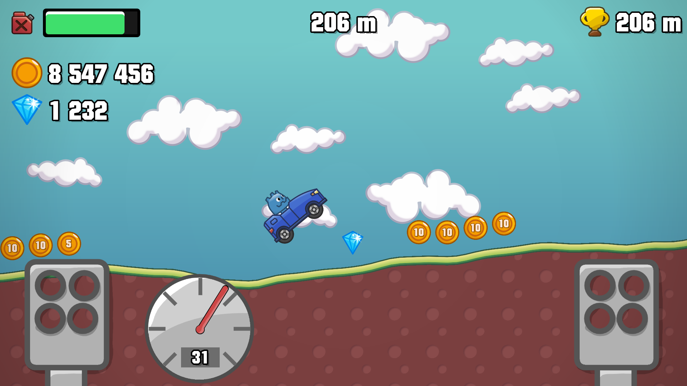
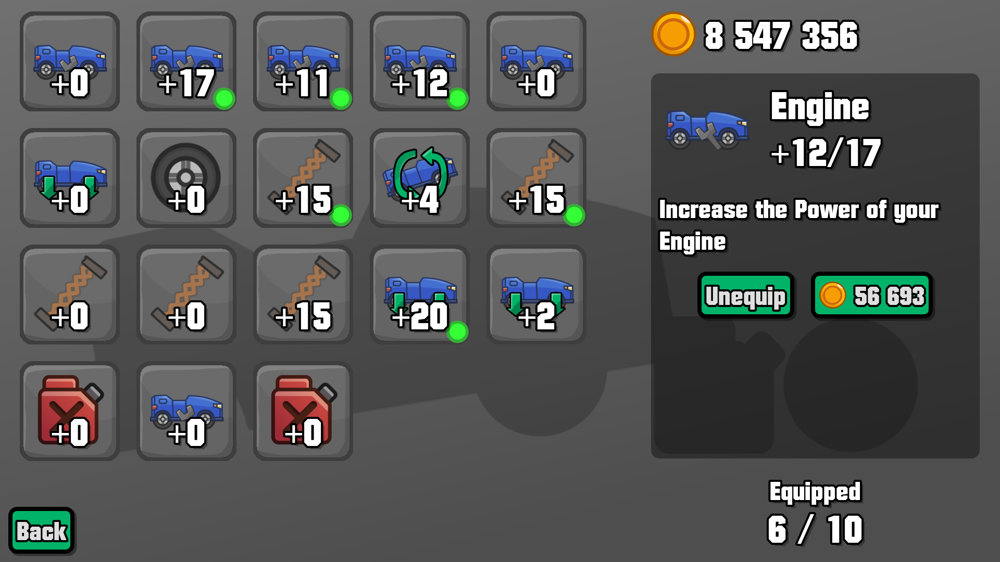

# Hill Climb Moddy

This is a Hill Climb Racing Fanmade with **mod**ular upgrades and easy possibility for **mod**ding with its permissive [MIT](./LICENSE) License.

# Credits

## Asset Packs
- https://lucylavend.itch.io/physics-car-game-asset-pack

## Sound Effects
- Sound Effect by <a href="https://pixabay.com/de/users/universfield-28281460/?utm_source=link-attribution&utm_medium=referral&utm_campaign=music&utm_content=121580">UNIVERSFIELD</a> from <a href="https://pixabay.com//?utm_source=link-attribution&utm_medium=referral&utm_campaign=music&utm_content=121580">Pixabay</a> (Sped up)
- Sound Effect from <a href="https://pixabay.com/sound-effects/?utm_source=link-attribution&utm_medium=referral&utm_campaign=music&utm_content=87313">Pixabay</a> (Cropped)

## Note

- Sound Effects have been normalized
- Credits are available ingame
